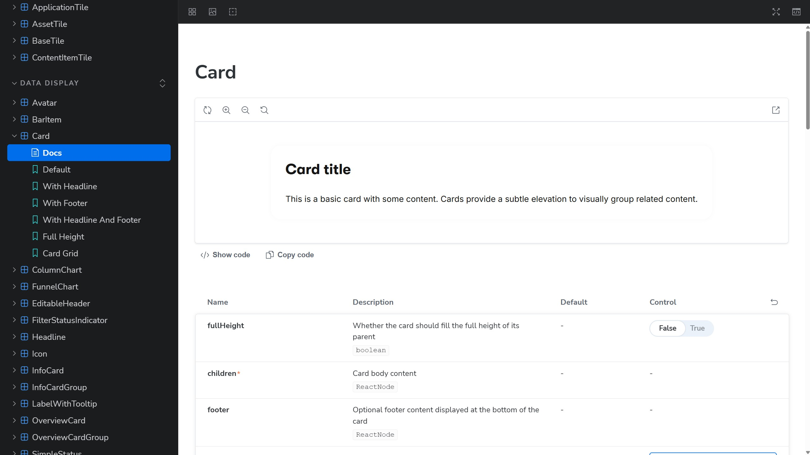
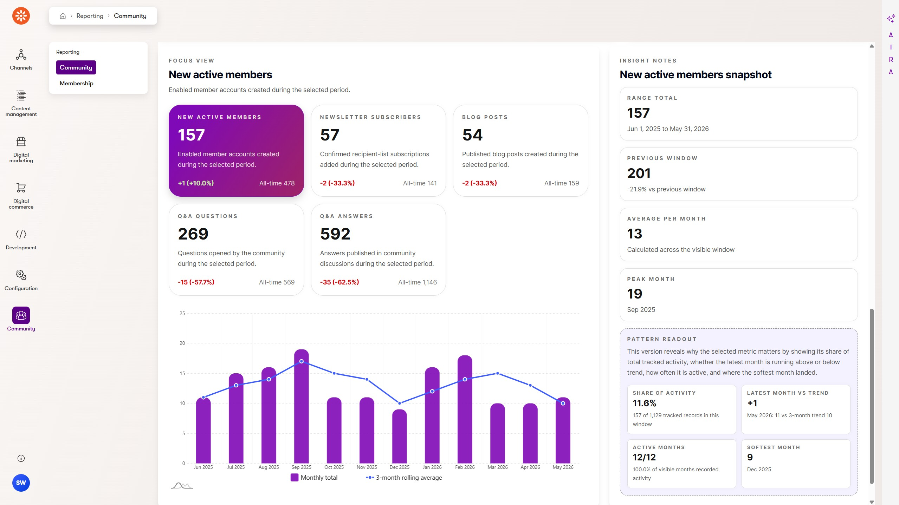
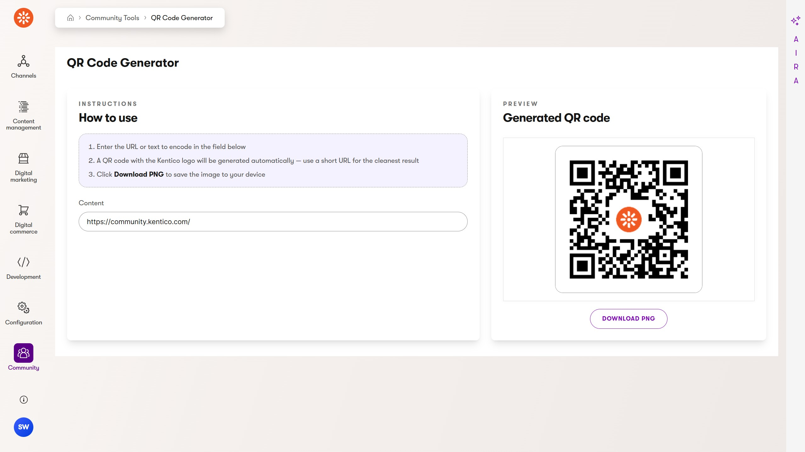
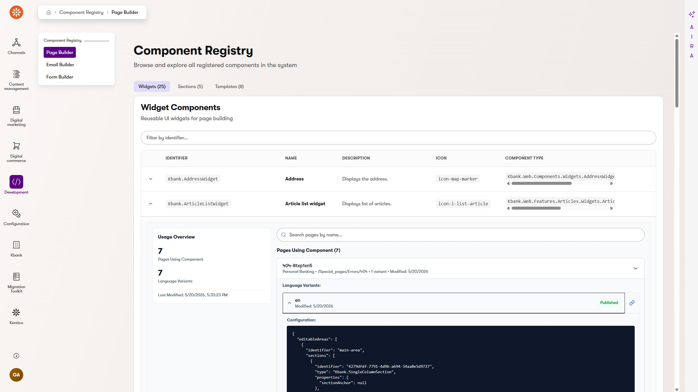
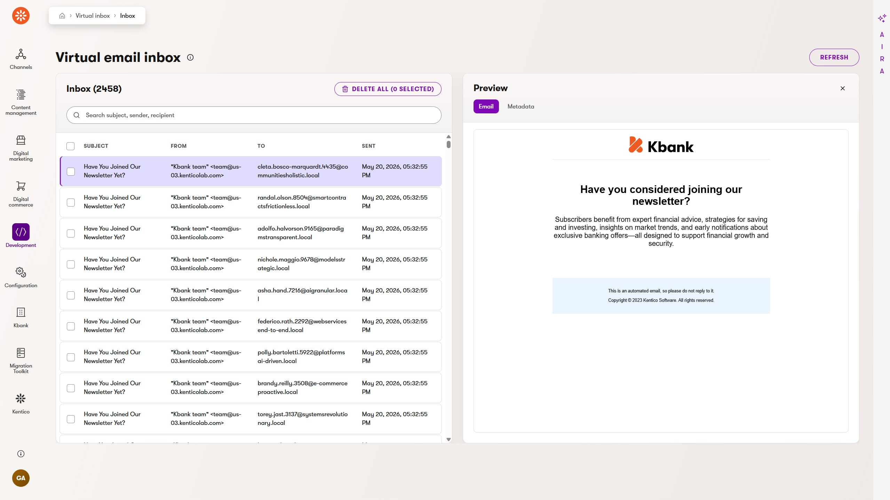
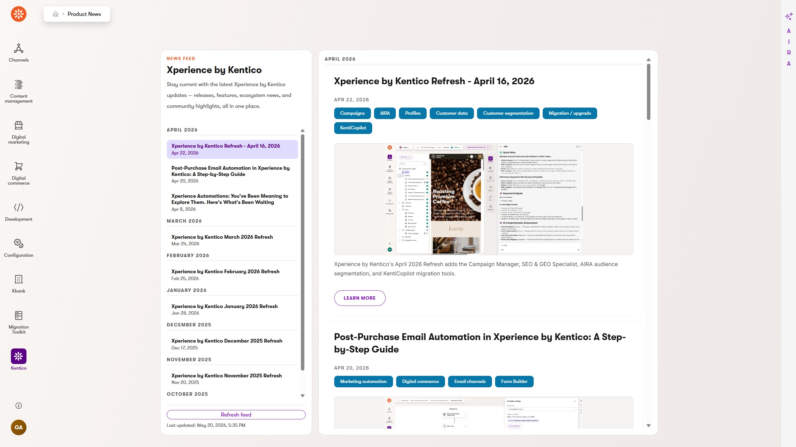

# Xperience by Kentico: Admin Design Components

[](https://github.com/Kentico/xperience-by-kentico-admin-design-components/actions/workflows/ci.yml)

[](https://github.com/Kentico/.github/blob/main/SUPPORT.md#labs-limited-support)

## Description

This repository is a modified **reference library** for the React components that power the Xperience by Kentico administration UI — the same components published to npm as [`@kentico/xperience-admin-components`](https://www.npmjs.com/package/@kentico/xperience-admin-components).

It is a core part of [KentiCopilot](https://docs.kentico.com/guides/development/kenticopilot) — a suite of AI development tools that enables agentic development for Xperience by Kentico projects — and helps AI agents extend Xperience by Kentico's administration UI:

1. **Reference for `@kentico/xperience-admin-components`** — Browse source, types, stories, and screenshots to understand how the official packaged components work, how their rendered HTML is structured, and when to reach for them.
2. **Design token system** — `src/styles/tokens.css` contains the CSS custom properties used in the admin UI. Reference these tokens when building custom layouts with your own React components that must match Xperience's visual design.
3. **Copy-on-demand** — When the npm package doesn't cover a need, copy component source files directly into your project ([shadcn](https://ui.shadcn.com/) model). Copied component code is the developer's responsibility. Therefore, this is a customization fallback, not the primary workflow.

Details on Xperience by Kentico's administration UI architecture and extension process can be found in [the official documentation](https://docs.kentico.com/documentation/developers-and-admins/customization/extend-the-administration-interface).

### Component categories

| Category     | What's in it                              |
| ------------ | ----------------------------------------- |
| `actions`    | Buttons, menus, triggers                  |
| `form`       | Inputs, selects, date pickers, checkboxes |
| `layout`     | Containers, stacks, grids, panels         |
| `feedback`   | Alerts, toasts, spinners, progress        |
| `navigation` | Breadcrumbs, tabs, pagination             |
| `display`    | Labels, badges, icons, avatars, tables    |
| `complex`    | Composed multi-component patterns         |



## Examples

Custom Xperience admin UI extensions built using this design system:

**Community Portal — Reporting** ([source](https://github.com/Kentico/community-portal/blob/v31.4.2.2/src/Kentico.Community.Portal.Admin/Client/src/features/reports/CommunityStatsLayoutTemplate.tsx))


**Community Portal — QR Code Generator** ([source](https://github.com/Kentico/community-portal/blob/v31.4.2.2/src/Kentico.Community.Portal.Admin/Client/src/features/community-tools/QRCodeGeneratorTemplate.tsx))


**KBank — Component Registry** ([source](https://github.com/Kentico/xperience-by-kentico-component-registry/blob/v1.0.1/src/Kentico.Xperience.ComponentRegistry.Admin/Client/src/component-viewer/PageBuilderComponentViewerTemplate.tsx))


**KBank — Virtual Inbox** ([source](https://github.com/Kentico/xperience-by-kentico-virtual-inbox/blob/v1.3.0/src/Kentico.Xperience.VirtualInbox.Admin/Client/src/inbox/VirtualInboxTemplate.tsx))


**KBank — News Feed** ([source](https://github.com/Kentico/xperience-by-kentico-news-feed/blob/v1.0.1/src/Kentico.Xperience.NewsFeed.Admin/Client/src/layouts/NewsFeedTemplate.tsx))


## Requirements

### Dependencies

- [Node.js](https://nodejs.org/) v24 or newer
- [React](https://react.dev/) 18 or newer
- [TypeScript](https://www.typescriptlang.org/) 5 or newer

### Other requirements

- A Xperience by Kentico project using the admin extension pattern (custom React-based admin UI modules)

## Quick Start

> **Using an AI agent?** See [AGENTS.md](./AGENTS.md) for the full workflow. Claude Code users have `/list-components` and `/add-component` skills available when working in this repo.

### 1. Using @kentico/xperience-admin-components (recommended)

Search `registry.json` or use the `/list-components` skill to find a component. Read its source in `src/components/<ComponentName>/` or its preview in `previews/` to understand the API, then use the component from the npm package in your Xperience project.

### 2. Using design tokens

Copy `src/styles/tokens.css` and `src/index.css` into your project, then import in your app entry point (order matters):

```ts
import "./src/styles/tokens.css";
import "./src/index.css";
```

This enables agents to use these tokens for custom Xperience administration UI React components and maintain design consistency with the rest of the application experience.

### 3. Copy-on-demand (customize a component)

1. Clone or download this repository locally.

2. Copy the shared base files into your project once:

   | Source                  | Destination in your project                |
   | ----------------------- | ------------------------------------------ |
   | `src/lib/cn.ts`         | `src/lib/cn.ts`                            |
   | `src/tokens/colors.ts`  | `src/tokens/colors.ts`                     |
   | `src/styles/tokens.css` | `src/styles/tokens.css`                    |
   | `src/index.css`         | append to your root CSS or import directly |

3. Install the base npm dependency:

   ```bash
   npm install classnames
   ```

4. Find the component in `registry.json`. Copy the files listed under `files` to `src/components/<ComponentName>/` in your project. Install any `npmDeps` listed.

See the [Usage Guide](./docs/Usage-Guide.md) for full copy instructions including dependency resolution.

## Browsing Components

Run Storybook locally to interactively browse and preview all components:

```bash
npm install
npm run storybook
```

Storybook will be available at `http://localhost:6006`.

## Contributing

To see the guidelines for Contributing to Kentico open source software, please see [Kentico's `CONTRIBUTING.md`](https://github.com/Kentico/.github/blob/main/CONTRIBUTING.md) for more information and follow the [Kentico's `CODE_OF_CONDUCT`](https://github.com/Kentico/.github/blob/main/CODE_OF_CONDUCT.md).

Instructions and technical details for contributing to **this** project can be found in [Contributing Setup](./docs/Contributing-Setup.md).

## License

Distributed under the MIT License. See [`LICENSE.md`](./LICENSE.md) for more information.

## Support

[](https://github.com/Kentico/.github/blob/main/SUPPORT.md#labs-limited-support)

This project has **Kentico Labs limited support**.

See [`SUPPORT.md`](https://github.com/Kentico/.github/blob/main/SUPPORT.md#labs-limited-support) for more information.

For any security issues see [`SECURITY.md`](https://github.com/Kentico/.github/blob/main/SECURITY.md).
